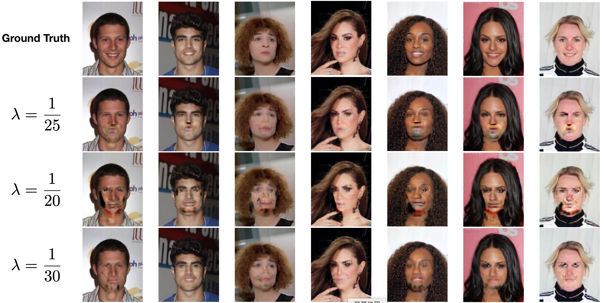
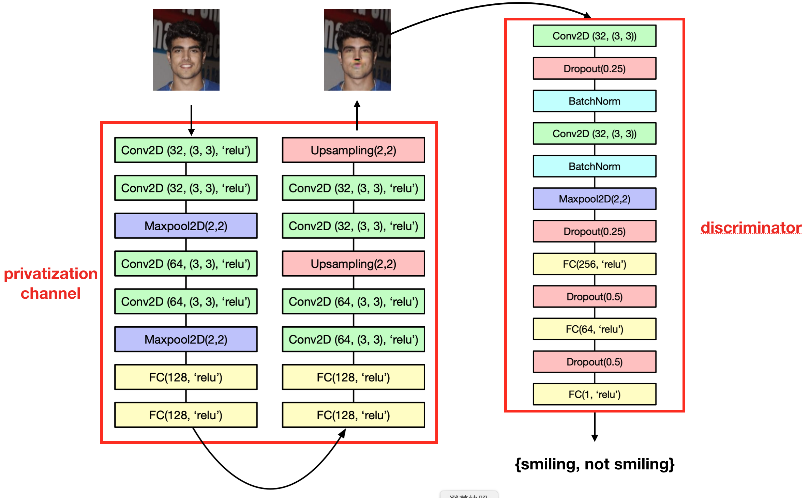

# Local Privatization Mechanism via Generative Adversarial Training

This is part of CS230 2020 winter course project.

## Datasets

[Large-scale CelebFaces Attributes (CelebA) Dataset](http://mmlab.ie.cuhk.edu.hk/projects/CelebA.html)
Details can be found in the paper _Z. Liu, P. Luo, X. Wang, and X. Tang, “Deep learning face attributes in the wild,” in ICCV, 2015_.

## Results

    

## Proposed Framework

    

## Author
[Wei-Ning Chen](http://weiningchen.github.io/), Dennis Rich, Harry Chen

